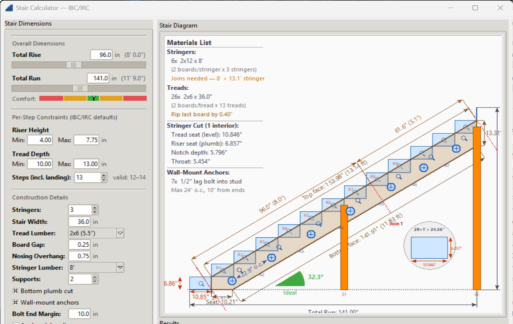

# Stair Calculator

A desktop stair calculator built with Python and tkinter that computes optimal step configurations from total rise and run dimensions, validated against IBC/IRC building code constraints. Includes a live scaled diagram with full stringer geometry, materials list, and construction details.



---

## Features

### Interactive Dimension Controls
- **Total rise/run sliders** with mouse-wheel scrolling; **Shift+scroll for fine-tuning** (5× slower)
- **Two-way slider↔entry binding** — type an exact value or drag the slider
- **Comfort gauge** — live colored 2R+T bar below the Total Run slider (green/yellow/red zones with needle indicator)

### Per-Step Constraints
- Adjustable **min/max riser height and tread depth** — IBC/IRC defaults pre-loaded
- **Step count selector** — spinbox lets you pick any step count (including landing); constraints never override your choice
- Displays valid range alongside the spinbox

### Optimal Step Calculation
- **Scores all valid N values** by weighted distance from ideal rise (7") and tread (11")
- Automatically selects the optimal step count, or lets you override manually
- Shows **Optimal / Valid / Out of range** status for the current selection

### Construction Details
- **Stringer count** (2–10), **stair width**, **tread lumber** (dropdown with common sizes: 1×6 through 2×12, 5/4×6)
- **Board gap** and **nosing overhang** inputs
- **Stringer lumber length** — Auto (picks shortest standard 8'–20' board) or manual selection
- **Bottom plumb cut** option — toggles between tapered point and plumb-cut-with-ground-seat stringer bottom
- **Wall-mount anchors** — toggles lag bolt placement markers on the stringer:
  - Per-board bolt distribution using cos(angle)-adjusted top face length
  - Adjustable end margin (default 12") subtracted from the horizontal planning length
  - Bolts positioned at 75% board depth for tear-out resistance
  - Spacing dimension label between first two bolts
  - **Anchor debug lines** checkbox — shows vertical guide lines for board edges (green), margin insets (red), and bolt X positions (blue)

### Live Stair Diagram
- **Scaled canvas drawing** that redraws on every input change and resizes with the window
- **Step profile** — filled rectangles with stair-step polyline outline (blue for valid, red tint for out-of-range)
- **First-riser and first-tread dimensions** shown in the step detail circle (not on the main diagram)
- **Overall rise/run dimension lines** with extension lines and labels
- **2×12 stringer overlay** — full polygon with wood fill/stipple showing:
  - Top face and bottom face with along-stringer dimension lines (inches and feet)
  - Plumb end cuts at top and bottom, dimensioned
  - Bottom foot/seat dimension
  - Riser notch markers (R1, R2, …) on the top face
  - Bottom bearing indicator
- **4-side stringer dimensioning** — all four sides of the cut stringer shape are dimensioned with perpendicular extension lines
- **Stair angle arc indicator** — color-coded pie slice (green=ideal 30°–35°, yellow=warn, red=bad) with degree label and rating text, positioned in the whitespace triangle
- **Board join markers** — when lumber is shorter than the stringer, red dashed perpendicular lines at each join with per-segment dimension callouts
- **Intermediate support markers** — orange circles along the stringer when span exceeds 8 ft
- **Step detail inset** — zoomed single-step view in a circle scaled to the lower-right whitespace triangle (scales with window resize), showing riser/tread dimensions, diagonal hypotenuse, and 2R+T value with proportionally scaled text and arrows
- **Materials list** (upper-left) showing:
  - Stringer count, lumber size, and length (with auto-selection note)
  - Tread board count, size, and cut length (with boards-per-tread breakdown)
  - Rip-cut note when last board overhangs the tread
  - Join warning when lumber is shorter than the stringer
  - **Interior stringer notch cuts** — tread seat, riser seat, notch depth, and throat dimensions with IBC minimum (3.5") warning

### Results Summary
- **Riser height**, **tread depth**, **2R+T** with comfort rating (Ideal / Slightly steep / Slightly shallow / Too steep / Too shallow)
- **Stringer length** (inches and feet), **intermediate supports** count and spacing
- **Stair angle** with ideal range reference

### Application Features
- **Single-instance enforcement** — only one window runs at a time; re-launching brings the existing window to front (Windows mutex)
- **Settings persistence** — all inputs (dimensions, constraints, construction details, selected step count) and window size/position saved to `stair_settings.json` and restored on next launch
- **Reset button** — one click back to IBC/IRC defaults (Ctrl+R shortcut)
- **Bottom plumb cut toggle** — changes stringer bottom geometry between tapered and plumb-cut styles, updating the diagram and board length calculation

---

## IBC/IRC Defaults

| Parameter     | Min    | Max    | Ideal  |
|---------------|--------|--------|--------|
| Riser Height  | 4.00"  | 7.75"  | 7.00"  |
| Tread Depth   | 10.00" | 11.00" | 11.00" |
| 2R + T        | —      | —      | 24–25" |
| Stair Angle   | 25°    | 40°    | 30°–35°|

---

## Step Count Convention

- **N** = number of risers
- **N − 1** = number of treads
- `riser = total_rise / N`
- `tread = total_run / (N − 1)`

---

## Requirements

- Python 3.10+ (3.14 recommended)
- tkinter (included with standard Python on Windows)

No third-party packages required.

---

## Running

```bash
python main.py
```

Or use the included `launch.bat` on Windows.

---

## Project Structure

```
Stair-Tool/
├── main.py                  # Entry point (single-instance mutex)
├── app.py                   # App controller (root window, wires panels)
├── models.py                # StairModel + StepConfig (pure logic, no tkinter)
├── constants.py             # IBC/IRC defaults, canvas sizes, colors, lumber options
├── stairs.ico               # App icon
├── launch.bat               # Windows launcher script
├── stair_settings.json      # Auto-generated settings persistence
├── panels/
│   ├── input_panel.py       # Left panel: sliders, constraints, step count, construction inputs, comfort gauge
│   └── results_panel.py     # Right panel: canvas diagram, stringer geometry, materials list, results summary
├── widgets/
│   ├── labeled_slider.py    # LabeledSlider: Scale + Entry with two-way binding
│   └── constraint_row.py    # ConstraintRow: min/max entry pair
└── docs/
    └── screenshot.png
```
