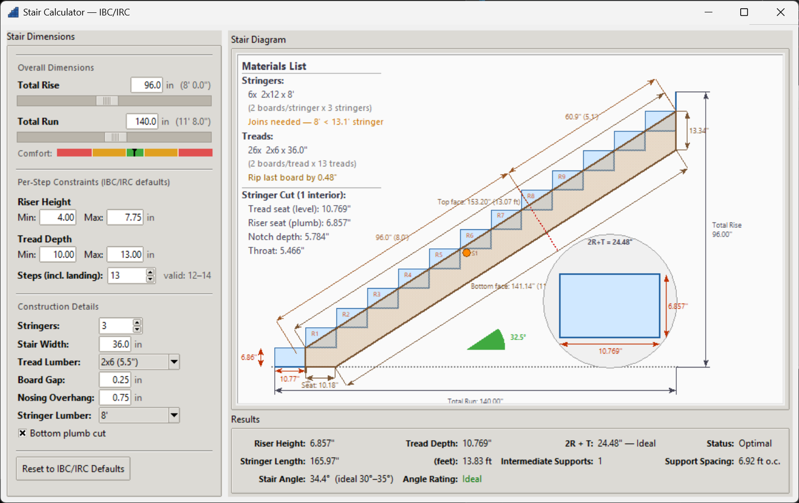

# Stair Tool

A desktop stair calculator built with Python and tkinter that computes optimal step configurations from total rise and run dimensions, validated against IBC/IRC building code constraints.



---

## Features

- **Interactive sliders** for total rise and run (in inches)
- **Per-step constraint controls** — adjustable min/max riser height and tread depth (IBC/IRC defaults pre-loaded)
- **Optimal step count selection** — scores all valid N values by closeness to ideal rise (7") and tread (11")
- **Manual N override** — spinbox lets you pick any step count (including landing); constraints never override your choice
- **Construction details** — stringer count, stair width, and tread lumber board size inputs
- **Live stair diagram** — scaled canvas drawing with:
  - Step profile and filled rectangles
  - First-riser and first-tread dimension arrows
  - Overall rise/run dimension callouts
  - 2×12 stringer overlay with plumb end cuts, notch marks, and full 4-side dimensioning
  - Stair angle arc indicator (color-coded ideal/warn/bad zones)
  - Intermediate support markers when stringer span exceeds 8 ft
  - **Materials list** (upper-left) — stringer and tread lumber requirements with board counts, sizes, and rip-cut notes
  - **Step detail inset** (lower-right) — zoomed single-step view with riser/tread dimensions and 2R+T
- **Comfort gauge** — color-coded 2R+T bar (ideal 24"–25")
- **Results summary** — riser, tread, 2R+T, stringer length/angle, support count/spacing
- **Settings persistence** — all inputs (dimensions, constraints, construction details) saved and restored on next launch
- **Reset button** — one click back to IBC/IRC defaults (Ctrl+R shortcut)

---

## IBC/IRC Defaults

| Parameter     | Min    | Max    | Ideal  |
|---------------|--------|--------|--------|
| Riser Height  | 4.00"  | 7.75"  | 7.00"  |
| Tread Depth   | 10.00" | 11.00" | 11.00" |
| 2R + T        | —      | —      | 24–25" |
| Stair Angle   | —      | —      | 30°–35°|

---

## Step Count Convention

- **N** = number of risers
- **N − 1** = number of treads
- `riser = total_rise / N`
- `tread = total_run / (N − 1)`

---

## Requirements

- Python 3.10+ (3.14 recommended)
- tkinter (included with standard Python on Windows)

No third-party packages required.

---

## Running

```bash
python main.py
```

---

## Project Structure

```
Stair-Tool/
├── main.py                  # Entry point
├── app.py                   # App controller (root window, wires panels)
├── models.py                # StairModel + StepConfig (pure logic)
├── constants.py             # IBC/IRC defaults, canvas sizes, colors
├── panels/
│   ├── input_panel.py       # Left panel: sliders + constraint fields
│   └── results_panel.py     # Right panel: canvas diagram + summary
├── widgets/
│   ├── labeled_slider.py    # LabeledSlider: Scale + Entry two-way binding
│   └── constraint_row.py    # ConstraintRow: min/max entry pair
└── docs/
    └── screenshot.png
```
